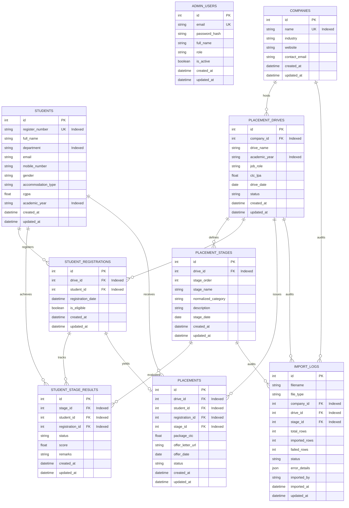

# Database Schema Documentation — Placement Cell Management Portal

## Overview

The Placement Cell Management and Analytics Portal uses a **normalized PostgreSQL relational database** designed to handle complex campus recruitment funnels, multi-round selection processes, student registrations, and audit logs.

Unlike uncontrolled Excel spreadsheets, this database separates concerns into **9 core entities**, enforcing data integrity via strict foreign keys, unique constraints, and composite indexes.

---

## Entity-Relationship (ER) Diagram

---

## Detailed Data Dictionary

### 1. `admin_users`
Stores system administrative credentials and roles.

| Column Name | Data Type | Constraints | Description |
| :--- | :--- | :--- | :--- |
| `id` | `INTEGER` | `PRIMARY KEY`, `AUTOINCREMENT` | Unique user ID |
| `email` | `VARCHAR(150)` | `UNIQUE`, `NOT NULL`, `INDEX` | Admin email address |
| `password_hash` | `VARCHAR(255)` | `NOT NULL` | SHA256/Bcrypt password hash |
| `full_name` | `VARCHAR(200)` | `NOT NULL` | Admin user full name |
| `role` | `VARCHAR(50)` | `NOT NULL`, Default: `'ADMIN'` | Role (`SUPER_ADMIN`, `PLACEMENT_OFFICER`) |
| `is_active` | `BOOLEAN` | `NOT NULL`, Default: `TRUE` | Account active flag |
| `created_at` | `TIMESTAMPTZ` | `NOT NULL`, Default: `NOW()` | Record creation timestamp |
| `updated_at` | `TIMESTAMPTZ` | `NOT NULL`, Default: `NOW()` | Record update timestamp |

### 2. `students`
Master repository of all student profiles across academic years.

| Column Name | Data Type | Constraints | Description |
| :--- | :--- | :--- | :--- |
| `id` | `INTEGER` | `PRIMARY KEY`, `AUTOINCREMENT` | Unique student internal ID |
| `register_number` | `VARCHAR(50)` | `UNIQUE`, `NOT NULL`, `INDEX` | Official Register/Roll number (e.g. `7376231CS333`) |
| `full_name` | `VARCHAR(200)` | `NOT NULL` | Student full name |
| `department` | `VARCHAR(100)` | `NULLABLE`, `INDEX` | Academic department (e.g. `Computer Science`) |
| `email` | `VARCHAR(150)` | `NULLABLE` | Student institutional email |
| `mobile_number` | `VARCHAR(30)` | `NULLABLE` | Contact phone number |
| `gender` | `VARCHAR(20)` | `NULLABLE` | Gender (`Male`, `Female`, `Other`) |
| `accommodation_type`| `VARCHAR(50)` | `NULLABLE` | Accommodation (`Day Scholar`, `Hosteller`) |
| `cgpa` | `FLOAT` | `NULLABLE` | Academic CGPA score |
| `academic_year` | `VARCHAR(20)` | `NULLABLE`, `INDEX` | Batch year (e.g. `2026-2027`) |
| `created_at` | `TIMESTAMPTZ` | `NOT NULL`, Default: `NOW()` | Record creation timestamp |
| `updated_at` | `TIMESTAMPTZ` | `NOT NULL`, Default: `NOW()` | Record update timestamp |

**Indexes**:
- `ix_students_register_number` (Unique index)
- `idx_student_dept_year` Composite index on `(department, academic_year)`

### 3. `companies`
Registered recruiting organizations.

| Column Name | Data Type | Constraints | Description |
| :--- | :--- | :--- | :--- |
| `id` | `INTEGER` | `PRIMARY KEY`, `AUTOINCREMENT` | Unique company ID |
| `name` | `VARCHAR(200)` | `UNIQUE`, `NOT NULL`, `INDEX` | Company name (e.g. `Netgear`, `Presidio`) |
| `industry` | `VARCHAR(100)` | `NULLABLE` | Industry domain |
| `website` | `VARCHAR(200)` | `NULLABLE` | Company website URL |
| `contact_email` | `VARCHAR(150)` | `NULLABLE` | HR contact email |
| `created_at` | `TIMESTAMPTZ` | `NOT NULL`, Default: `NOW()` | Record creation timestamp |
| `updated_at` | `TIMESTAMPTZ` | `NOT NULL`, Default: `NOW()` | Record update timestamp |

### 4. `placement_drives`
Specific recruitment events hosted by companies for a batch year.

| Column Name | Data Type | Constraints | Description |
| :--- | :--- | :--- | :--- |
| `id` | `INTEGER` | `PRIMARY KEY`, `AUTOINCREMENT` | Unique drive ID |
| `company_id` | `INTEGER` | `FK(companies.id)`, `CASCADE`, `NOT NULL` | Parent company |
| `drive_name` | `VARCHAR(200)` | `NOT NULL` | Drive title (e.g. `Netgear Drive 2026`) |
| `academic_year` | `VARCHAR(20)` | `NOT NULL`, `INDEX` | Target batch (e.g. `2026-2027`) |
| `job_role` | `VARCHAR(150)` | `NULLABLE` | Target job designation |
| `ctc_lpa` | `FLOAT` | `NULLABLE` | Offered CTC in LPA |
| `drive_date` | `DATE` | `NULLABLE` | Drive execution date |
| `status` | `VARCHAR(50)` | `NOT NULL`, Default: `'ACTIVE'` | Drive status (`ACTIVE`, `COMPLETED`) |
| `created_at` | `TIMESTAMPTZ` | `NOT NULL`, Default: `NOW()` | Record creation timestamp |
| `updated_at` | `TIMESTAMPTZ` | `NOT NULL`, Default: `NOW()` | Record update timestamp |

**Unique Constraints**:
- `uq_drive_company_name_year`: `(company_id, drive_name, academic_year)`

### 5. `placement_stages`
Company-specific multi-round hiring process stages.

| Column Name | Data Type | Constraints | Description |
| :--- | :--- | :--- | :--- |
| `id` | `INTEGER` | `PRIMARY KEY`, `AUTOINCREMENT` | Unique stage ID |
| `drive_id` | `INTEGER` | `FK(placement_drives.id)`, `CASCADE`, `NOT NULL` | Parent placement drive |
| `stage_order` | `INTEGER` | `NOT NULL` | Sequential order (1, 2, 3, etc.) |
| `stage_name` | `VARCHAR(200)` | `NOT NULL` | Stage title (e.g. `Round 2 - Technical Test`) |
| `normalized_category`| `VARCHAR(50)`| `NOT NULL`, Default: `'PROGRESSION'`| Category (`REGISTERED`, `PROGRESSION`, `PLACED`) |
| `description` | `VARCHAR(500)` | `NULLABLE` | Stage description |
| `stage_date` | `DATE` | `NULLABLE` | Stage execution date |
| `created_at` | `TIMESTAMPTZ` | `NOT NULL`, Default: `NOW()` | Record creation timestamp |
| `updated_at` | `TIMESTAMPTZ` | `NOT NULL`, Default: `NOW()` | Record update timestamp |

**Unique Constraints**:
- `uq_stage_drive_order`: `(drive_id, stage_order)`

### 6. `student_registrations`
Maps student applications to specific placement drives.

| Column Name | Data Type | Constraints | Description |
| :--- | :--- | :--- | :--- |
| `id` | `INTEGER` | `PRIMARY KEY`, `AUTOINCREMENT` | Registration ID |
| `drive_id` | `INTEGER` | `FK(placement_drives.id)`, `CASCADE`, `NOT NULL` | Target drive |
| `student_id` | `INTEGER` | `FK(students.id)`, `CASCADE`, `NOT NULL` | Registered student |
| `registration_date`| `TIMESTAMPTZ` | `NOT NULL`, Default: `NOW()` | Timestamp of registration |
| `is_eligible` | `BOOLEAN` | `NOT NULL`, Default: `TRUE` | Eligibility status |
| `created_at` | `TIMESTAMPTZ` | `NOT NULL`, Default: `NOW()` | Record creation timestamp |
| `updated_at` | `TIMESTAMPTZ` | `NOT NULL`, Default: `NOW()` | Record update timestamp |

**Unique Constraints**:
- `uq_student_drive_reg`: `(drive_id, student_id)`

### 7. `student_stage_results`
Records candidate progression and attendance across selection stages.

| Column Name | Data Type | Constraints | Description |
| :--- | :--- | :--- | :--- |
| `id` | `INTEGER` | `PRIMARY KEY`, `AUTOINCREMENT` | Result ID |
| `stage_id` | `INTEGER` | `FK(placement_stages.id)`, `CASCADE`, `NOT NULL` | Evaluated stage |
| `student_id` | `INTEGER` | `FK(students.id)`, `CASCADE`, `NOT NULL` | Evaluated student |
| `registration_id` | `INTEGER` | `FK(student_registrations.id)`, `CASCADE`, `NULLABLE` | Drive registration reference |
| `status` | `VARCHAR(50)` | `NOT NULL`, Default: `'QUALIFIED'` | Result (`QUALIFIED`, `DISQUALIFIED`, `ABSENT`) |
| `score` | `FLOAT` | `NULLABLE` | Test/interview score |
| `remarks` | `VARCHAR(500)` | `NULLABLE` | Evaluator notes |
| `created_at` | `TIMESTAMPTZ` | `NOT NULL`, Default: `NOW()` | Record creation timestamp |
| `updated_at` | `TIMESTAMPTZ` | `NOT NULL`, Default: `NOW()` | Record update timestamp |

**Unique Constraints**:
- `uq_stage_student_result`: `(stage_id, student_id)`

### 8. `placements`
Final job offers issued to students.

| Column Name | Data Type | Constraints | Description |
| :--- | :--- | :--- | :--- |
| `id` | `INTEGER` | `PRIMARY KEY`, `AUTOINCREMENT` | Placement record ID |
| `drive_id` | `INTEGER` | `FK(placement_drives.id)`, `CASCADE`, `NOT NULL` | Source drive |
| `student_id` | `INTEGER` | `FK(students.id)`, `CASCADE`, `NOT NULL` | Placed student |
| `registration_id` | `INTEGER` | `FK(student_registrations.id)`, `CASCADE`, `NULLABLE` | Registration reference |
| `stage_id` | `INTEGER` | `FK(placement_stages.id)`, `SET NULL`, `NULLABLE` | Offer stage reference |
| `package_ctc` | `FLOAT` | `NULLABLE` | Final agreed package CTC (LPA) |
| `offer_letter_url` | `VARCHAR(500)` | `NULLABLE` | Path/URL to offer document |
| `offer_date` | `DATE` | `NULLABLE` | Date of offer issuance |
| `status` | `VARCHAR(50)` | `NOT NULL`, Default: `'OFFERED'` | Offer state (`OFFERED`, `ACCEPTED`, `REJECTED`) |
| `created_at` | `TIMESTAMPTZ` | `NOT NULL`, Default: `NOW()` | Record creation timestamp |
| `updated_at` | `TIMESTAMPTZ` | `NOT NULL`, Default: `NOW()` | Record update timestamp |

**Unique Constraints**:
- `uq_placement_drive_student`: `(drive_id, student_id)`

### 9. `import_logs`
Audit trails of Excel workbook ingestion sessions.

| Column Name | Data Type | Constraints | Description |
| :--- | :--- | :--- | :--- |
| `id` | `INTEGER` | `PRIMARY KEY`, `AUTOINCREMENT` | Log ID |
| `filename` | `VARCHAR(500)` | `NOT NULL` | Uploaded Excel file name |
| `file_type` | `VARCHAR(50)` | `NOT NULL`, Default: `'EXCEL'` | Ingestion source format |
| `company_id` | `INTEGER` | `FK(companies.id)`, `SET NULL`, `NULLABLE` | Target company |
| `drive_id` | `INTEGER` | `FK(placement_drives.id)`, `CASCADE`, `NULLABLE` | Target drive |
| `stage_id` | `INTEGER` | `FK(placement_stages.id)`, `SET NULL`, `NULLABLE` | Target stage |
| `total_rows` | `INTEGER` | `NOT NULL`, Default: `0` | Total rows parsed |
| `imported_rows` | `INTEGER` | `NOT NULL`, Default: `0` | Successfully inserted/updated rows |
| `failed_rows` | `INTEGER` | `NOT NULL`, Default: `0` | Failed/quarantined rows |
| `status` | `VARCHAR(50)` | `NOT NULL`, Default: `'SUCCESS'` | Ingestion status (`SUCCESS`, `PARTIAL`, `FAILED`) |
| `error_details` | `JSON` | `NULLABLE` | JSON details of errors and warnings |
| `imported_by` | `VARCHAR(150)` | `NULLABLE` | Admin email who triggered import |
| `imported_at` | `TIMESTAMPTZ` | `NOT NULL`, Default: `NOW()` | Ingestion timestamp |
| `updated_at` | `TIMESTAMPTZ` | `NOT NULL`, Default: `NOW()` | Timestamp of last status update |
