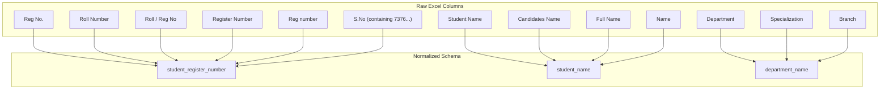

# Placement Cell Excel Data Dictionary & Structure Report

This document provides a comprehensive analysis of the actual college placement Excel files stored in `sample_data/`. It serves as the single source of truth for the dataset structure, sheet taxonomies, column naming variations, data anomalies, and cross-round progression patterns.

---

## 1. Summary of Sample Workbooks Analyzed

| Workbook Name | File Size | Sheet Count | Total Data Records Across Sheets | Primary Unique Register Format | Key Characteristics |
| :--- | :--- | :--- | :--- | :--- | :--- |
| **`Netgear - Roundwise.xlsx`** | 37.8 KB | 4 | 407 records | 12-char Alphanumeric (`7376...`) | Structured roundwise sheets; header offset on Rounds 3 & 4; 2 malformed records in Registered. |
| **`PRESIDIO.xlsx`** | 26.5 KB | 3 | 432 records | 12-char Alphanumeric (`7376...`) | Clean layout; column titles shift between Round 1 & Round 2; trailing whitespace in sheet name `"offer "`. |
| **`Soliton Roundwise Details.xlsx`** | 57.3 KB | 7 | 637 records | 12-char Alphanumeric (`7376...`) | Multi-stage funnel (5 rounds + Offer + Absentee sheet); severe column content shift in Rounds 4, 5, OFFER. |

---

## 2. Workbook-by-Workbook Breakdown

### Workbook 1: `Netgear - Roundwise.xlsx`

* **Total Sheets**: 4 (`Registered`, `Round 2`, `Round 3`, `Round 4`)
* **Header Rows**:
  * `Registered`: Row 1
  * `Round 2`: Row 1
  * `Round 3`: Row 3 (Rows 1–2 contain merged title banner: *"2023-2027 Batch Netgear Placement Drive Shortlisted List"* and date *"Date : 23.07.2026 AN ROUND 3"*)
  * `Round 4`: Row 3 (Rows 1–2 contain merged title banner and date *"ROUND 4"*)

#### Sheet Level Analysis:

| Sheet Name | Dimensions | Header Row | Column Mapping | Records | Unique Regs | Duplicates | Malformed | Category |
| :--- | :--- | :--- | :--- | :--- | :--- | :--- | :--- | :--- |
| `Registered` | 336 x 8 | Row 1 | Reg No: Col 2 (`Reg No.`) Name: Col 3 (`Name`) Gender: Col 4 (`Gender`) Dept: Col 8 (`Specialization`) | 335 | 335 | 0 | 2 | Registered Sheet |
| `Round 2` | 61 x 4 | Row 1 | Reg No: Col 2 (`Reg No.`) Name: Col 3 (`Name`) Dept: Col 4 (`Specialization`) | 60 | 60 | 0 | 0 | Progression Sheet |
| `Round 3` | 13 x 6 | Row 3 | Reg No: Col 2 (`Reg No.`) Name: Col 3 (`Name`) Gender: Col 4 (`Gender`) | 10 | 10 | 0 | 0 | Progression Sheet |
| `Round 4` | 5 x 6 | Row 3 | Reg No: Col 2 (`Reg No.`) Name: Col 3 (`Name`) Gender: Col 4 (`Gender`) | 2 | 2 | 0 | 0 | Progression Sheet |

#### Identified Anomalies in `Netgear - Roundwise.xlsx`:
1. **Row 178 of `Registered`**: Register Number `7377231CS289` — Typo in college batch prefix (`7377` instead of standard `7376`).
2. **Row 213 of `Registered`**: Register Number `8667022811` — 10-digit mobile phone number entered into the `Reg No.` column for student `THILAK R P`.
3. **Cross-Round Retention**: All 60 students in `Round 2`, 10 students in `Round 3`, and 2 students in `Round 4` exist in the master `Registered` sheet (100% retention rate).

---

### Workbook 2: `PRESIDIO.xlsx`

* **Total Sheets**: 3 (`Round 1`, `Round 2`, `offer `)
* **Header Rows**: Row 1 across all sheets.
* **Special Note**: The third sheet name has a **trailing space** (`"offer "`).

#### Sheet Level Analysis:

| Sheet Name | Dimensions | Header Row | Column Mapping | Records | Unique Regs | Duplicates | Malformed | Category |
| :--- | :--- | :--- | :--- | :--- | :--- | :--- | :--- | :--- |
| `Round 1` | 420 x 4 | Row 1 | Reg No: Col 2 (`Roll Number `) Name: Col 3 (`Student Name`) Dept: Col 4 (`Department`) | 419 | 419 | 0 | 0 | Progression Sheet / Master |
| `Round 2` | 11 x 4 | Row 1 | Reg No: Col 2 (`Reg No`) Name: Col 3 (`Candidates Name`) Dept: Col 4 (`Department`) | 10 | 10 | 0 | 0 | Progression Sheet |
| `offer ` | 4 x 4 | Row 1 | Reg No: Col 2 (`Reg No`) Name: Col 3 (`Candidates Name`) Dept: Col 4 (`Department`) | 3 | 3 | 0 | 0 | Placed Sheet |

#### Identified Anomalies in `PRESIDIO.xlsx`:
1. **Header Name Inconsistency**:
   * Round 1 uses `Roll Number ` (with trailing space) and `Student Name`.
   * Round 2 & `offer ` switch to `Reg No` and `Candidates Name`.
   * Round 1 header ` S no` has a leading space.
2. **Funnel Progression Discrepancy**:
   * Two students in `Round 2` (`7376231CS333` THAYANITHI S and `7376232AL164` Naveen Krishnaa S) were **NOT present in the Round 1 sheet**.
   * Student `7376231CS333` (THAYANITHI S) appears in `offer ` (placed) but was **missing from Round 1**.

---

### Workbook 3: `Soliton Roundwise Details.xlsx`

* **Total Sheets**: 7 (`Round 1`, `AB`, `Round 2`, `Round 3`, `Round 4`, `Design round 5`, `OFFER`)
* **Header Rows**: Row 1 across all sheets.

#### Sheet Level Analysis:

| Sheet Name | Dimensions | Header Row | Column Mapping | Records | Unique Regs | Duplicates | Malformed | Category |
| :--- | :--- | :--- | :--- | :--- | :--- | :--- | :--- | :--- |
| `Round 1` | 1000 x 26 | Row 1 | Reg No: Col 2 (`Roll / Reg No`) Name: Col 3 (`Full Name`) Dept: Col 4 (`Branch`) | 520 | 520 | 0 | 0 | Master Registered / Round 1 |
| `AB` | 13 x 5 | Row 1 | Reg No: Col 2 (`Register Number `) Name: Col 3 (`Name`) Col 5: Status (`AB`) | 12 | 12 | 0 | 0 | Absentee Sheet (Special) |
| `Round 2` | 1000 x 4 | Row 1 | Reg No: Col 2 (`Reg number`) Name: Col 3 (`Name`) Dept: Col 4 (`Department`) | 46 | 46 | 0 | 0 | Progression Sheet |
| `Round 3` | 31 x 4 | Row 1 | Reg No: Col 2 (`Roll/Reg No`) Name: Col 3 (`Full Name`) Dept: Col 4 (`Branch`) | 30 | 30 | 0 | 0 | Progression Sheet |
| `Round 4` | 13 x 2 | Row 1 | **Reg No: Col 1 (`S.No`)** Name: Col 2 (`Name`) | 12 | 12 | 0 | 0 | Progression Sheet (Shifted) |
| `Design round 5` | 11 x 2 | Row 1 | **Reg No: Col 1 (`S.No`)** Name: Col 2 (`Name`) | 10 | 10 | 0 | 0 | Progression Sheet (Shifted) |
| `OFFER` | 8 x 8 | Row 1 | **Reg No: Col 7 (`S.No`)** Name: Col 8 (`Name`) | 7 | 7 | 0 | 0 | Placed Sheet (Shifted & Offset) |

#### Identified Anomalies in `Soliton Roundwise Details.xlsx`:
1. **Critical Column Shift (Severe Parsing Trap)**:
   * In `Round 4` and `Design round 5`, the column header is labeled `S.No`, but the data cells under this column contain **Register Numbers** (e.g. `7376231SE116`, `7376231EC158`).
   * In `OFFER`, columns 1–6 are completely empty (`None`). Column 7 is labeled `S.No` but contains Register Numbers, and Column 8 is labeled `Name` containing Student Names.
2. **Formula Error Artifacts**:
   * In `Round 1`, column 5 is titled `ad` and contains `#N/A` excel formula errors across all 520 rows.
3. **Absentee Tracking (`AB` sheet)**:
   * `AB` contains 12 candidates who were absent for Round 1. All 12 exist in the Round 1 master sheet.

---

## 3. Structural Patterns & Differences Across Companies

### Common Patterns Across All Workbooks
1. **Register Number Format**: Almost all valid register numbers follow the 12-character BITSATHY pattern: `7376` + `YY` (2-digit admission year, e.g. `23`) + `DEPT_CODE` (2 characters, e.g. `AD`, `CS`, `EC`, `IT`, `AL`, `CB`, `CD`, `SE`, `AG`, `ME`, `BM`, `BT`, `CT`, `EI`, `EE`) + `3-digit roll number` (e.g. `7376232AD101`).
2. **Sheet Granularity**: Placement files are organized by rounds using individual Excel sheets (e.g., `Round 1`, `Round 2`, `Round 3`, `OFFER`).
3. **Student Identification**: Register numbers are the primary unique keys, but some later-stage sheets omit department metadata, relying on student names or register numbers to join with master lists.

### Divergent Patterns Across Companies
| Aspect | Netgear | Presidio | Soliton |
| :--- | :--- | :--- | :--- |
| **Initial Sheet Name** | `Registered` | `Round 1` | `Round 1` |
| **Placed Sheet Name** | Included in round count (`Round 4` has 2 selects) | `offer ` (with trailing space) | `OFFER` (in uppercase) |
| **Header Row Position** | Mixed (Row 1 for early rounds, Row 3 for rounds with title banner) | Always Row 1 | Always Row 1 |
| **Column Titles for Reg No** | `Reg No.` | `Roll Number `, `Reg No` | `Roll / Reg No`, `Reg number`, `Roll/Reg No`, `Register Number `, **`S.No`** |
| **Column Titles for Dept** | `Specialization` | `Department` | `Branch`, `Department` |
| **Missing Columns in Late Rounds** | Dept omitted in Rounds 3 & 4 | None | Dept omitted in Rounds 4, 5 & OFFER; Reg No mislabeled as `S.No` |

---

## 4. Column Synonym Dictionary & Mapping Rules

To successfully normalize Excel data in Phase 3, the parser must support the following field synonyms:

### Keyword Mappings:

* **Register Number Field**:
  * Matches: `reg no`, `reg no.`, `roll number`, `roll / reg no`, `roll/reg no`, `register number`, `reg number`, `roll no`, `htno`, `registration no`.
  * **Fallback rule**: If a column header is `S.No` or `S No`, check data cells. If values match regex `^7376[0-9]{2}[A-Z0-9]{5,6}$`, re-map the column as Register Number.

* **Student Name Field**:
  * Matches: `name`, `student name`, `candidates name`, `full name`, `candidate name`, `name of the student`.

* **Department Field**:
  * Matches: `department`, `dept`, `branch`, `specialization`, `stream`, `degree`, `course`.

* **Gender Field**:
  * Matches: `gender`, `sex`.

* **Contact Fields**:
  * Mobile: `mobile no`, `mobile`, `phone`, `contact no`.
  * Email: `email id`, `email`, `mail id`.
  * Accommodation: `d/ h`, `day scholar / hosteller`, `hostel`.

---

## 5. Sheet Taxonomy & Categorization

Every sheet in a company placement workbook falls into one of four functional categories:

### 1. Registered Sheets (`Registered`, `Round 1`, `Master`)
* **Purpose**: List of all eligible, registered, or appeared candidates.
* **Examples**:
  * `Netgear - Roundwise.xlsx` -> `Registered` (335 records)
  * `PRESIDIO.xlsx` -> `Round 1` (419 records)
  * `Soliton Roundwise Details.xlsx` -> `Round 1` (520 records)

### 2. Progression / Round Sheets (`Round 2`, `Round 3`, `Round 4`, `Design round 5`)
* **Purpose**: Shortlisted candidates progressing through selection rounds.
* **Examples**:
  * `Netgear - Roundwise.xlsx` -> `Round 2` (60), `Round 3` (10), `Round 4` (2)
  * `PRESIDIO.xlsx` -> `Round 2` (10)
  * `Soliton Roundwise Details.xlsx` -> `Round 2` (46), `Round 3` (30), `Round 4` (12), `Design round 5` (10)

### 3. Placed / Offered Sheets (`offer `, `OFFER`, `Final Selects`)
* **Purpose**: Candidates who received final job offers.
* **Examples**:
  * `PRESIDIO.xlsx` -> `offer ` (3 records, sheet name has trailing space)
  * `Soliton Roundwise Details.xlsx` -> `OFFER` (7 records)
  * `Netgear - Roundwise.xlsx` -> `Round 4` (2 records act as final selects)

### 4. Special / Ambiguous / Summary Sheets (`AB`, `Summary`, `Stats`)
* **Purpose**: Absentee lists, aggregate counts, or non-student records.
* **Examples**:
  * `Soliton Roundwise Details.xlsx` -> `AB` (12 records of absentees)

---

## 6. Data Quality & Anomalies Master Summary

| Anomaly Type | Workbook | Sheet | Row / Location | Details & Impact |
| :--- | :--- | :--- | :--- | :--- |
| **Malformed Reg No** | `Netgear - Roundwise.xlsx` | `Registered` | Row 178 | `7377231CS289` — Invalid batch code `7377`. Parser must flag as malformed. |
| **Data In Wrong Col** | `Netgear - Roundwise.xlsx` | `Registered` | Row 213 | `8667022811` — 10-digit phone number in `Reg No.` column for `THILAK R P`. |
| **Missing From Round 1**| `PRESIDIO.xlsx` | `Round 2` & `offer ` | Rows 2 & 4 | Candidates `7376231CS333` & `7376232AL164` in Round 2/Offer were absent in Round 1. |
| **Column Misalignment**| `Soliton Roundwise Details.xlsx` | `Round 4`, `Design round 5` | Header Row | Register numbers stored under `S.No` column header. |
| **Empty Col Offset** | `Soliton Roundwise Details.xlsx` | `OFFER` | Columns 1–6 | Columns 1–6 are empty; Reg No & Name are shifted to Col 7 & Col 8. |
| **Sheet Name Whitespace**| `PRESIDIO.xlsx` | Sheet name | `"offer "` | Trailing space in sheet title. Sheet matching must use `.strip()`. |
| **Formula Errors** | `Soliton Roundwise Details.xlsx` | `Round 1` | Col 5 (`ad`) | `#N/A` formula evaluation errors across all 520 rows. |

---

## 7. Direct Guidance for Phase 3 Import Logic

When Phase 3 (Import & Normalization Pipeline) is implemented, the ingestion engine MUST incorporate the following validation and parsing rules:

1. **Header Row Auto-Detection**:
   * Do not assume header is always on Row 1. Scan rows 1–10 for string density and header keyword matches.
2. **Column Misalignment Fallback**:
   * If a column named `S.No` or `S No` contains strings matching register number regex (`^7376...`), treat that column as the Register Number column.
3. **Register Number Validation**:
   * Regex rule: `^7376\d{2}[A-Za-z0-9]{5,6}$`.
   * Standardize to UPPERCASE.
   * Strip spaces and non-alphanumeric characters.
   * Flag strings with invalid batch codes (e.g., `7377`) or numeric length = 10 (phone numbers) as `is_malformed = True`.
4. **Sheet Name Trimming & Taxonomy Matching**:
   * Always apply `.strip().lower()` to sheet names.
   * Classify sheets using fuzzy matching:
     * Placed: `offer`, `select`, `placed`, `final`
     * Progression: `round`, `shortlist`, `stage`, `level`, `test`
     * Registered: `registered`, `applicant`, `database`, `all`, `master`
5. **Cross-Round Candidate Resolution**:
   * If a candidate appears in a progression sheet or offer sheet without being in Round 1/Registered sheet, auto-create/link the candidate record to maintain funnel integrity.

---
*Report generated during Phase 2 Real Excel Structure Analysis.*
